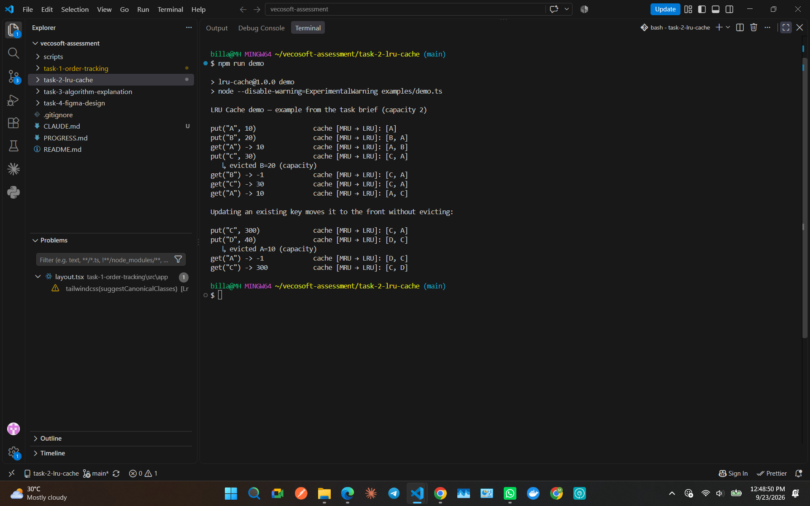
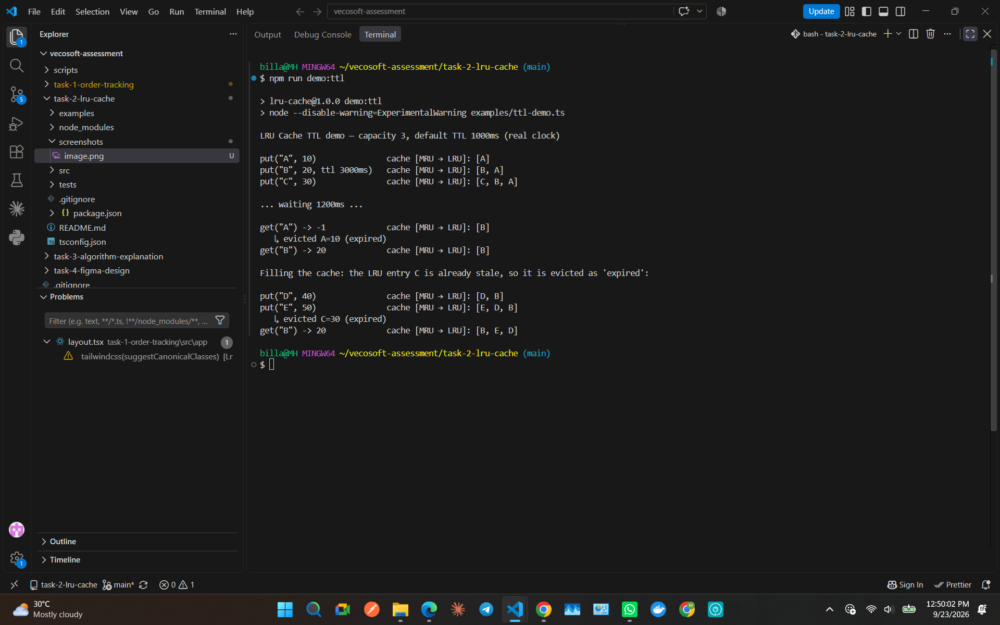
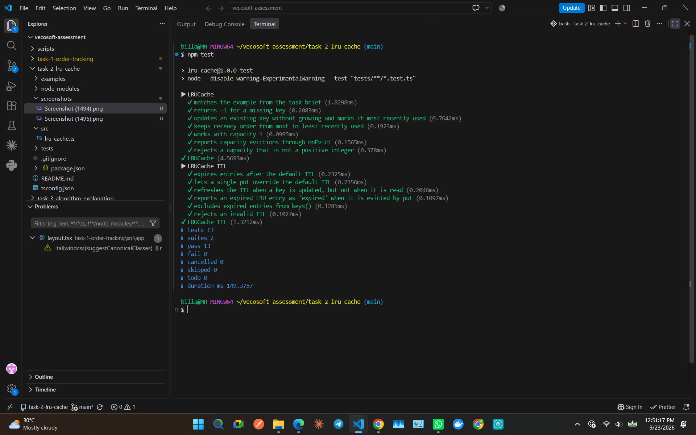

# LRU Cache (TypeScript)

A Least Recently Used cache with **O(1) `get` and `put`**, plus optional **TTL (time-to-live) expiration**.
It is written in TypeScript, runs directly on Node.js (no build step) and has **zero runtime dependencies**.

```ts
const cache = new LRUCache<string, number>(2);
cache.put("A", 10);
cache.put("B", 20);
cache.get("A");     // 10
cache.put("C", 30); // evicts B (least recently used)
cache.get("B");     // -1
cache.get("C");     // 30
cache.get("A");     // 10
```

## How to run

Requires **Node.js 22.18+** (it runs `.ts` files natively).

```bash
npm install          # dev tooling only (typescript, @types/node)
npm test             # 13 unit tests (node:test)
npm run demo         # the example from the brief, printing every put/get/eviction
npm run demo:ttl     # TTL expiration demo (real clock)
npm run typecheck    # strict type check with tsc
```

## Project structure

```
src/lru-cache.ts          LRUCache implementation
tests/lru-cache.test.ts   unit tests (LRU behaviour + TTL, using a fake clock)
examples/demo.ts          the example from the brief, traced step by step
examples/ttl-demo.ts      TTL expiration demo
examples/trace.ts         shared console formatting for the demos
```

## Data structures and why

| Structure | Role | Why |
|---|---|---|
| **Hash map** (`Map<K, Entry>`) | key → list node | O(1) average lookup of any key |
| **Doubly linked list** | recency order (head = most recently used, tail = least recently used) | O(1) to unlink a node from anywhere and re-insert it at the head, because each node knows its `prev` and `next` |

Neither structure is enough on its own:
- A map alone can't tell you which key is least recently used without scanning.
- A list alone can't find a key without walking it.

The map stores a pointer straight to the list node, so every operation is a constant number of pointer updates.

The list uses two **sentinel (dummy) nodes**, `head` and `tail`, that never hold data. Every real node therefore always has a `prev` and a `next`, so inserting and unlinking need no special cases for an empty list or for the first/last node.

## How LRU ordering is maintained

- **`get(key)` hit:** the node is unlinked and re-inserted right after the **head** sentinel.
- **`put` of an existing key:** the value is updated and the node moves to the **head**.
- **`put` of a new key:** the node is inserted at the **head**. If the cache is already full, the node just before the **tail** sentinel (least recently used) is removed from both the list and the map first.

So the list is always ordered from most recently used (head) to least recently used (tail), and eviction always removes the tail.

## Complexity

| Operation | Time | Notes |
|---|---|---|
| `get` | **O(1)** average | map lookup + constant pointer updates |
| `put` | **O(1)** average | map lookup/insert + constant pointer updates (+ O(1) tail eviction) |
| `keys()` | O(n) | debug/demo helper only |

**Space:** O(capacity). There is one map entry and one list node per stored key.

"Average" O(1) is because hash map operations are amortised constant time.

## Bonus: TTL / expiration

```ts
const cache = new LRUCache<string, number>(3, { ttlMs: 1000 }); // default TTL for every entry
cache.put("A", 10);       // expires 1000ms after insertion
cache.put("B", 20, 3000); // per-entry override
```

**Approach: lazy expiration.** Each node stores an absolute `expiresAt` timestamp, and there are no timers or background sweeps:
- `get` checks `expiresAt`. A stale entry is removed and `-1` is returned.
- `put` refreshes the TTL of the key it writes. When the cache is full, it evicts the tail and reports the reason as `"expired"` or `"capacity"`.
- Reading a key does **not** extend its TTL. Only writing does, which is the usual "expire after write" behaviour.
- `onEvict(key, value, reason)` reports every automatic removal. The clock (`now`) can be injected, so the tests are deterministic.

**Trade-offs:**
- ✅ `get` and `put` stay **O(1)**. There are no timers to manage or leak, and no work happens between calls.
- ⚠️ An expired entry that is never read keeps using a slot until it becomes the LRU tail, so `size` can include stale entries. The fix would be an O(n) sweep or a min-heap ordered by expiry, which makes `put` O(log n). For a bounded LRU cache, the extra cost wasn't worth it.
- ⚠️ When the cache is full, an expired entry in the *middle* of the list is not preferred over a live tail. Choosing it would need that same sweep or heap.

## Limitations and design notes

- **Returning `-1` for a miss is part of the required API.** It becomes ambiguous if `-1` is itself a stored value. In a real library I'd return `undefined` or add a `has(key)` method.
- **Not thread-safe.** That's fine on single-threaded JavaScript. A cache shared between workers would need its own synchronisation.
- **Scan-heavy workloads hurt any LRU cache.** Reading many distinct keys once, more keys than the capacity, evicts the useful hot keys. Policies like LRU-K, 2Q or W-TinyLFU resist this better.

## Output

`npm run demo`: the example from the brief, with every put/get/eviction:



`npm run demo:ttl`: TTL expiry, including a stale LRU entry evicted as `expired`:



`npm test`: 13 tests passing:


